# CSE 168 Final Project
## By Nicholas Nakano and Matthew Gross
## Objectives
In this project, we aimed to implement Volumetric Lighting, Glass BSDFs, and .obj and .mtl file import support. 
- We implemented Single Scattering and Volumetric Lighting by following implementation from [UCSD's CSE 272 class](https://cseweb.ucsd.edu/~tzli/cse272/wi2023/homework2.pdf), and Pixar's SIGGRAPH 2017 [presentation](https://graphics.pixar.com/library/ProductionVolumeRendering/paper.pdf).
- We implemented basic .obj and .mtl import support using the [Wikipedia page for Wavefront .obj files](https://en.wikipedia.org/wiki/Wavefront_.obj_file). To test our implementation (and for our final images), we used .obj and .mtl files from [Florida State University's website on .obj files](https://people.sc.fsu.edu/~jburkardt/data/obj/obj.html)
- We implemented Glass BSDFs using [lecture slides](http://15462.courses.cs.cmu.edu/spring2024/lecture/brdfs) from Carnegie Mellon University.

## Images of Volumetric Lighting
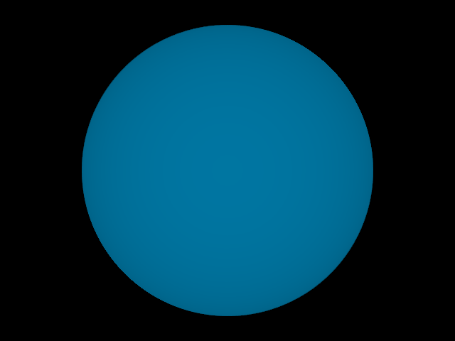

This is our basic setup of a sphere acting as a volume following Beer's Law.

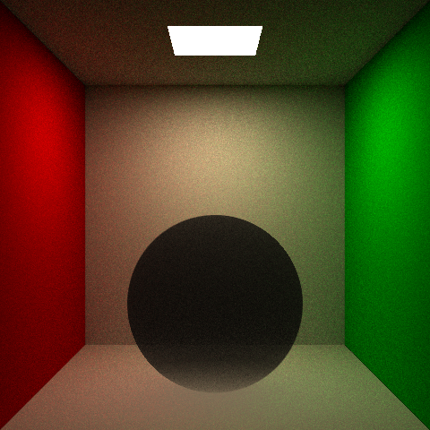 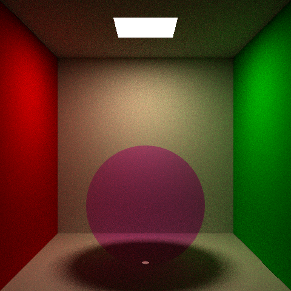

These images show a medium in the form of a sphere in the Cornell Box scene shown in previous CSE 168 homework assignments. The first image absorbs black particles, while the second one absorbs a magenta color.

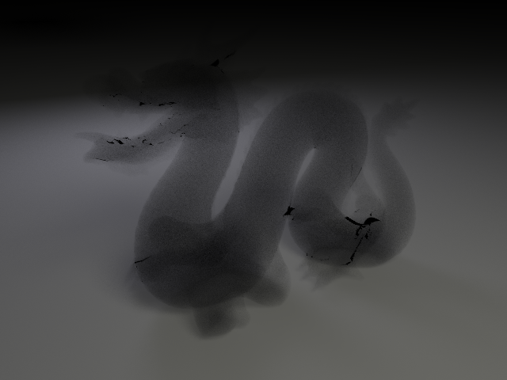 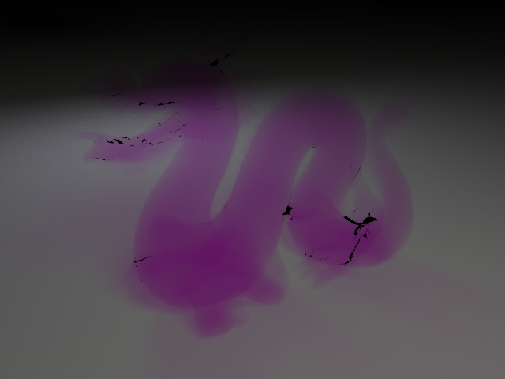

These images show the Stanford Dragon render from CSE 168 Homeworks 3 and 4, but now the dragons are acting as a medium for particles. Unfortunately, there is some artifacting that is visible on these images that we could not debug.

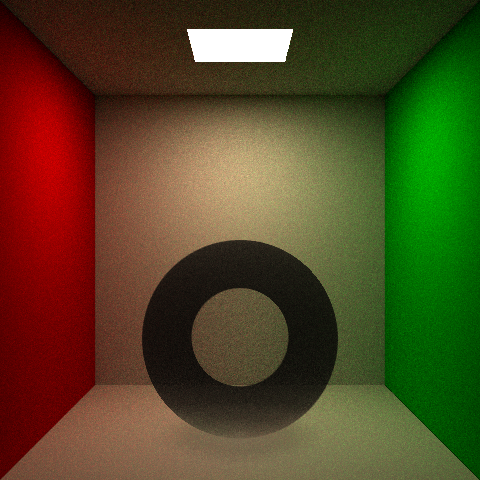

This image showcases Enveloping Volumes. The black sphere is a volume following Beer's Law, while the inside sphere is a vacuum.

## Images of Glass BSDFs
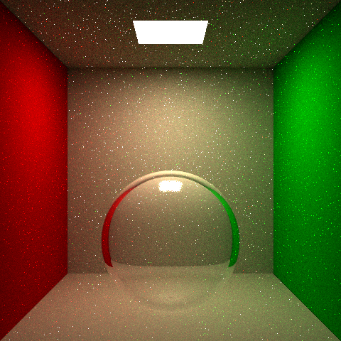

This image shows basic reflection and refraction on a glass sphere. There is significant noise in the image, but not enough to show bias.

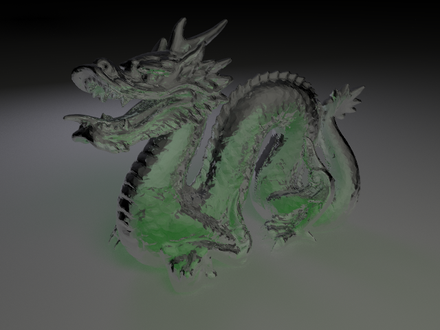

This image brings together our Volumetric Lighting setup and our Glass BSDF setup. The Stanford Dragon is now made completely of glass, and it also is a volume following Beer's Law. This is seen via the green particles inside of the dragon!

## Images of OBJ Imports
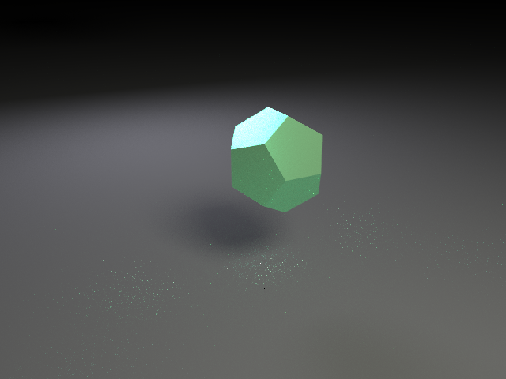

This is a simple dodecahedron that we downloaded from the FSU website and imported using an .obj and .mtl file parser that we wrote. It is rendered using the GGX BSDF from homework 4.

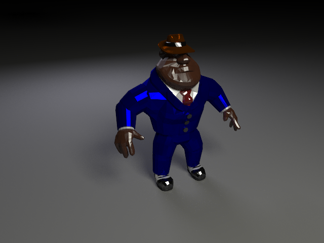 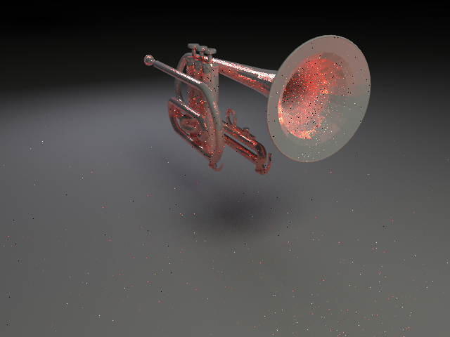

These are images of other basic objects from the FSU website that we applied materials to. The first one of the man had material values that were already included. The second one of the trumpet did not have material values, so we had to create those manually.